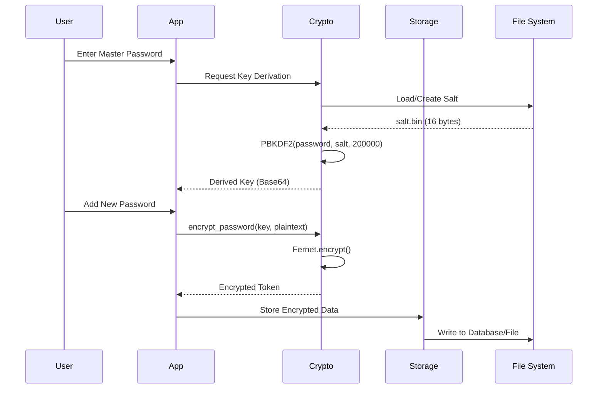

# LockGuardium Lite - Comprehensive Codebase Analysis

> A minimal, secure password vault application built with Python

**Document Version:** 1.0  
**Last Updated:** January 2026  
**Analysis Scope:** Complete repository analysis from Software Architect, Software Developer, and Product Manager perspectives

---

## Table of Contents

1. [Executive Summary](#1-executive-summary)
2. [Software Architect Perspective](#2-software-architect-perspective)
   - [2.1 System Overview](#21-system-overview)
   - [2.2 Architecture Pattern](#22-architecture-pattern)
   - [2.3 Module Organization](#23-module-organization)
   - [2.4 Security Architecture](#24-security-architecture)
   - [2.5 Data Flow Architecture](#25-data-flow-architecture)
   - [2.6 Technology Stack](#26-technology-stack)
   - [2.7 Dependency Analysis](#27-dependency-analysis)
3. [Software Developer Perspective](#3-software-developer-perspective)
   - [3.1 Repository Structure](#31-repository-structure)
   - [3.2 Code Implementation Status](#32-code-implementation-status)
   - [3.3 Core Module Deep Dive](#33-core-module-deep-dive)
   - [3.4 GUI Application Architecture](#34-gui-application-architecture)
   - [3.5 Testing Infrastructure](#35-testing-infrastructure)
   - [3.6 Development Environment](#36-development-environment)
   - [3.7 Key Algorithms and Functions](#37-key-algorithms-and-functions)
4. [Product Manager Perspective](#4-product-manager-perspective)
   - [4.1 Product Vision](#41-product-vision)
   - [4.2 Feature Inventory](#42-feature-inventory)
   - [4.3 User Personas](#43-user-personas)
   - [4.4 User Journeys](#44-user-journeys)
   - [4.5 Competitive Analysis](#45-competitive-analysis)
   - [4.6 Product Roadmap](#46-product-roadmap)
5. [Technical Deep Dive](#5-technical-deep-dive)
   - [5.1 Cryptographic Implementation](#51-cryptographic-implementation)
   - [5.2 Data Models](#52-data-models)
   - [5.3 State Management](#53-state-management)
6. [Appendices](#6-appendices)
   - [6.1 File Inventory](#61-file-inventory)
   - [6.2 API Reference](#62-api-reference)
   - [6.3 Glossary](#63-glossary)

---

## 1. Executive Summary

**LockGuardium Lite** is a secure, offline-first password vault application designed for users who prioritize privacy and local data control. Built with Python, the application leverages industry-standard cryptographic libraries to protect sensitive credentials using AES encryption with PBKDF2 key derivation.

### Key Highlights

| Aspect | Description |
|--------|-------------|
| **License** | MIT License (Open Source) |
| **Author** | Muhammed Musab Kaya |
| **Python Version** | 3.10+ |
| **Primary GUI** | CustomTkinter |
| **Encryption** | Fernet (AES-128-CBC with HMAC) |
| **Key Derivation** | PBKDF2-HMAC-SHA256 (200,000 iterations) |
| **Development Stage** | Early Development (Core crypto complete, GUI scaffolding in place) |

### Project Status at a Glance


---

## 2. Software Architect Perspective

### 2.1 System Overview

LockGuardium Lite follows a **layered architecture** pattern with clear separation of concerns between presentation, business logic, and data layers.


### 2.2 Architecture Pattern

The application implements a **Layered Architecture** with the following characteristics:


#### Design Patterns Employed

| Pattern | Location | Purpose |
|---------|----------|---------|
| **Facade** | `services/` | Simplifies complex crypto/storage operations |
| **Singleton** | `app.py` | Single application instance management |
| **Factory** | `generator.py` | Password creation with configurable options |
| **Repository** | `storage.py` (planned) | Data access abstraction |

### 2.3 Module Organization


### 2.4 Security Architecture

The security architecture is built on industry-standard cryptographic primitives:


#### Security Layers Deep Dive



#### Cryptographic Specifications

| Component | Specification | Security Level |
|-----------|---------------|----------------|
| **Salt** | 16 bytes from `os.urandom()` | CSPRNG |
| **Key Derivation** | PBKDF2-HMAC-SHA256 | NIST Recommended |
| **Iterations** | 200,000 | OWASP 2023 Minimum |
| **Encryption** | Fernet (AES-128-CBC) | Authenticated |
| **Integrity** | HMAC-SHA256 (in Fernet) | Tamper-evident |

### 2.5 Data Flow Architecture


### 2.6 Technology Stack


#### Technology Selection Rationale

| Technology | Choice | Rationale |
|------------|--------|-----------|
| **Python 3.10** | Language | Wide ecosystem, security libraries, cross-platform |
| **CustomTkinter** | GUI | Modern look, pure Python, no complex dependencies |
| **cryptography** | Security | Well-audited, NIST-compliant algorithms |
| **SQLite** | Database | Serverless, embedded, no configuration |
| **uv** | Package Manager | Fast, modern alternative to pip/poetry |

### 2.7 Dependency Analysis


---

## 3. Software Developer Perspective

### 3.1 Repository Structure

```
lockguardium-lite/
├── .gitignore                 # Git ignore rules
├── .python-version            # Python version specification (3.10)
├── LICENSE                    # MIT License
├── README.md                  # Project readme (needs content)
├── main.py                    # Entry point (placeholder)
├── pyproject.toml             # Project configuration
├── uv.lock                    # Dependency lock file
│
├── src/
│   └── lockguardium-lite/
│       ├── __init__.py        # Package initialization
│       ├── app.py             # Main GUI application (107 lines)
│       │
│       ├── core/              # Core functionality
│       │   ├── __init__.py
│       │   ├── crypto.py      # Cryptographic functions (37 lines) ✓
│       │   ├── generator.py   # Password generator (stub)
│       │   ├── models.py      # Data models (stub)
│       │   ├── storage.py     # Data persistence (stub)
│       │   └── utils.py       # Utility functions (stub)
│       │
│       ├── services/          # Business logic services
│       │   ├── __init__.py
│       │   ├── auth_service.py    # Authentication (stub)
│       │   └── vault_service.py   # Vault operations (stub)
│       │
│       └── ui/                # User interface components
│           ├── __init__.py
│           ├── dialogs.py         # Dialog windows (stub)
│           ├── login_window.py    # Login screen (stub)
│           └── vault_window.py    # Main vault view (stub)
│
└── tests/                     # Test files and prototypes
    ├── __init__.py
    ├── test.py                # CLI prototype (113 lines) ✓
    ├── test_app.py            # GUI prototype (33 lines) ✓
    ├── test_crypto.py         # PasswordManager class (95 lines) ✓
    ├── test_generator.py      # Password generator (53 lines) ✓
    ├── test_services.py       # Service tests (stub)
    ├── test_storage.py        # Storage tests (stub)
    └── test_utils.py          # Utility tests (stub)
```

### 3.2 Code Implementation Status


#### File Status Legend

| Status | Description | Count |
|--------|-------------|-------|
| ✅ **Implemented** | Functional code with complete logic | 5 files |
| ⚠️ **Partial** | Some functionality, needs completion | 2 files |
| 📝 **Stub** | Empty or placeholder only | 10 files |

### 3.3 Core Module Deep Dive

#### 3.3.1 Cryptography Module (`core/crypto.py`)


**Key Functions:**

| Function | Input | Output | Description |
|----------|-------|--------|-------------|
| `load_or_create_salt()` | None | `bytes` | Loads salt from file or creates new 16-byte random salt |
| `derive_key()` | password, salt | `bytes` | Derives 32-byte key using PBKDF2-HMAC-SHA256 |
| `encrypt_password()` | key, plaintext | `bytes` | Encrypts plaintext using Fernet |
| `decrypt_password()` | key, token | `str` | Decrypts Fernet token to plaintext |

#### 3.3.2 Password Generator (`tests/test_generator.py`)


**Parameters:**

| Parameter | Type | Default | Description |
|-----------|------|---------|-------------|
| `length` | `int` | 12 | Password length |
| `use_uppercase` | `bool` | True | Include A-Z |
| `use_lowercase` | `bool` | True | Include a-z |
| `use_digits` | `bool` | True | Include 0-9 |
| `use_special_chars` | `bool` | True | Include !@#$%^&* |

### 3.4 GUI Application Architecture


**Window Configuration:**

| Property | Value |
|----------|-------|
| Geometry | 960 x 640 pixels |
| Title | "LockGuardium Lite" |
| Theme | Dark (default) |
| Scaling | 100% (configurable 75%-120%) |

### 3.5 Testing Infrastructure


#### Test File Purposes

| File | Type | Coverage | Description |
|------|------|----------|-------------|
| `test.py` | Integration | CRUD, SQLite | CLI-based prototype demonstrating full workflow |
| `test_app.py` | Smoke | GUI | Basic GUI window instantiation test |
| `test_crypto.py` | Unit | Crypto, CRUD | PasswordManager class with encryption |
| `test_generator.py` | Unit | Generation | Password generation with options |

### 3.6 Development Environment

#### Setup Instructions

```bash
# Prerequisites
- Python 3.10+
- uv package manager

# Clone and setup
git clone <repository-url>
cd lockguardium-lite

# Install dependencies with uv
uv sync

# Activate virtual environment
source .venv/bin/activate

# Run the application
python src/lockguardium-lite/app.py

# Run CLI prototype
python tests/test.py

# Run tests
python tests/test_generator.py
```

#### Configuration Files

| File | Purpose |
|------|---------|
| `.python-version` | Specifies Python 3.10 for pyenv/asdf |
| `pyproject.toml` | Project metadata, dependencies |
| `uv.lock` | Locked dependency versions |
| `.gitignore` | Excludes sensitive files, caches |

### 3.7 Key Algorithms and Functions

#### Key Derivation Flow


#### Encryption/Decryption Process


---

## 4. Product Manager Perspective

### 4.1 Product Vision

**Vision Statement:**  
*"Empower users to securely manage their passwords locally, with no cloud dependency, using military-grade encryption in a simple, intuitive interface."*

**Product Positioning:**


### 4.2 Feature Inventory


#### Feature Status Matrix

| Feature | Status | Priority | Location |
|---------|--------|----------|----------|
| Master Password Authentication | ✅ Implemented | P0 | `core/crypto.py` |
| Password Encryption/Decryption | ✅ Implemented | P0 | `core/crypto.py` |
| Password Generator | ✅ Implemented | P1 | `tests/test_generator.py` |
| SQLite Storage | ✅ Prototype | P0 | `tests/test.py` |
| GUI Main Window | ✅ Implemented | P1 | `app.py` |
| Dark/Light Theme | ✅ Implemented | P2 | `app.py` |
| UI Scaling | ✅ Implemented | P3 | `app.py` |
| Login Window | 📝 Stub | P0 | `ui/login_window.py` |
| Password List View | ⚠️ Partial | P1 | `app.py` |
| Search Functionality | ⚠️ UI Only | P1 | `app.py` |
| Strength Checker | 📝 Stub | P2 | `app.py` |
| Recent Items | 📝 Stub | P3 | `app.py` |

### 4.3 User Personas

```mermaid
graph LR
    subgraph "Primary Personas"
        P1[👤 Privacy-Conscious User<br/>Wants no cloud sync<br/>Values data ownership]
        P2[👤 Power User<br/>Multiple accounts<br/>Needs strong passwords]
        P3[👤 Developer<br/>Needs auditable code<br/>May customize]
    end
    
    subgraph "Secondary Personas"
        S1[👤 Small Business Owner<br/>Team password sharing<br/>Compliance needs]
        S2[👤 Security Researcher<br/>Evaluating tools<br/>Testing encryption]
    end
```



#### Detailed Persona Profiles

| Persona | Goals | Pain Points | How LockGuardium Helps |
|---------|-------|-------------|------------------------|
| **Privacy-Conscious User** | Keep data local, avoid surveillance | Cloud services collect data | 100% offline, no telemetry |
| **Power User** | Manage 100+ passwords efficiently | Weak browser password managers | Strong encryption, search, organization |
| **Developer** | Audit security code, customize | Black-box commercial tools | Open source, clean architecture |
| **Small Business Owner** | Secure team passwords | Complex enterprise solutions | Simple deployment, no license fees |

### 4.4 User Journeys

#### 4.4.1 First-Time User Setup


#### 4.4.2 Daily Usage Flow

```mermaid
stateDiagram-v2
    [*] --> Launch
    Launch --> EnterMasterPassword
    EnterMasterPassword --> Unlock: Correct
    EnterMasterPassword --> EnterMasterPassword: Incorrect
    
    Unlock --> ViewPasswords
    ViewPasswords --> SearchPassword
    ViewPasswords --> AddPassword
    ViewPasswords --> EditPassword
    ViewPasswords --> DeletePassword
    ViewPasswords --> GeneratePassword
    
    SearchPassword --> CopyPassword
    CopyPassword --> ViewPasswords
    
    AddPassword --> EnterDetails
    EnterDetails --> SavePassword
    SavePassword --> ViewPasswords
    
    GeneratePassword --> CopyGenerated
    CopyGenerated --> ViewPasswords
    
    ViewPasswords --> Lock
    Lock --> [*]
```

#### 4.4.3 Password Creation Workflow

```mermaid
flowchart TD
    Start([User needs new password])
    
    Start --> Choice{Manual or<br/>Generated?}
    
    Choice -->|Manual| EnterManual[Enter password manually]
    Choice -->|Generated| OpenGen[Open Generator]
    
    OpenGen --> SetLength[Set length: 8-64 chars]
    SetLength --> SetOptions[Configure options:<br/>- Uppercase<br/>- Lowercase<br/>- Numbers<br/>- Special chars]
    SetOptions --> Generate[Generate Password]
    Generate --> Preview[Preview & Copy]
    Preview --> Satisfied{Satisfied?}
    Satisfied -->|No| Generate
    Satisfied -->|Yes| UsePassword[Use Generated Password]
    
    EnterManual --> CheckStrength[Check Strength]
    CheckStrength --> Strong{Strong enough?}
    Strong -->|No| EnterManual
    Strong -->|Yes| UsePassword
    
    UsePassword --> FillForm[Fill website/username/password]
    FillForm --> Encrypt[Encrypt & Store]
    Encrypt --> Confirm[Confirmation]
    Confirm --> End([Done])
```

### 4.5 Competitive Analysis

```mermaid
graph TB
    subgraph "Market Landscape"
        subgraph "Cloud-Based"
            B1[1Password]
            B2[LastPass]
            B3[Bitwarden]
            B4[Dashlane]
        end
        
        subgraph "Local-First"
            L1[KeePass]
            L2[KeePassXC]
            L3[LockGuardium Lite]
        end
        
        subgraph "Built-in"
            I1[Chrome Passwords]
            I2[Firefox Lockwise]
            I3[Apple Keychain]
        end
    end
    
    style L3 fill:#90EE90
```

#### Competitive Matrix

| Feature | LockGuardium Lite | KeePass | Bitwarden | 1Password |
|---------|-------------------|---------|-----------|-----------|
| **Offline Only** | ✅ | ✅ | ❌ | ❌ |
| **Open Source** | ✅ | ✅ | ✅ | ❌ |
| **Free** | ✅ | ✅ | ✅ (basic) | ❌ |
| **Cross-Platform** | ✅ | ⚠️ | ✅ | ✅ |
| **Modern UI** | ✅ | ❌ | ✅ | ✅ |
| **No Account Required** | ✅ | ✅ | ❌ | ❌ |
| **Self-Hostable** | N/A | N/A | ✅ | ❌ |

### 4.6 Product Roadmap

```mermaid
gantt
    title LockGuardium Lite Roadmap
    dateFormat  YYYY-MM
    
    section Phase 1: Foundation
    Core Encryption         :done, 2025-01, 2025-02
    Basic GUI Structure     :done, 2025-02, 2025-03
    Password Generator      :done, 2025-03, 2025-03
    
    section Phase 2: MVP
    Complete Login Flow     :active, 2025-04, 2025-05
    SQLite Integration      :2025-05, 2025-06
    Password CRUD in GUI    :2025-06, 2025-07
    
    section Phase 3: Enhancement
    Password Strength Meter :2025-07, 2025-08
    Search & Filter         :2025-08, 2025-09
    Auto-lock Feature       :2025-09, 2025-10
    
    section Phase 4: Polish
    Import/Export           :2025-10, 2025-11
    Browser Extension       :2025-11, 2026-01
    Mobile Companion        :2026-01, 2026-03
```

---

## 5. Technical Deep Dive

### 5.1 Cryptographic Implementation

#### 5.1.1 Key Derivation Function (KDF)

```mermaid
flowchart LR
    subgraph Input
        PW[Master Password<br/>String]
        Salt[Salt<br/>16 bytes]
    end
    
    subgraph PBKDF2["PBKDF2-HMAC-SHA256"]
        direction TB
        I1[Iteration 1]
        I2[Iteration 2]
        I3[...]
        I4[Iteration 200,000]
        I1 --> I2 --> I3 --> I4
    end
    
    subgraph Output
        Key[Derived Key<br/>32 bytes]
        B64[Base64 URL-Safe<br/>Encoded]
    end
    
    PW --> PBKDF2
    Salt --> PBKDF2
    PBKDF2 --> Key
    Key --> B64
```

#### 5.1.2 Fernet Encryption Details

```mermaid
flowchart TB
    subgraph "Fernet Token Structure"
        direction LR
        V[Version<br/>1 byte]
        TS[Timestamp<br/>8 bytes]
        IV[IV<br/>16 bytes]
        CT[Ciphertext<br/>Variable]
        HMAC[HMAC<br/>32 bytes]
    end
    
    subgraph "Encryption Process"
        Plain[Plaintext] --> Pad[PKCS7 Padding]
        Pad --> AES[AES-128-CBC]
        AES --> CT
    end
    
    subgraph "Authentication"
        V --> Sign
        TS --> Sign
        IV --> Sign
        CT --> Sign[HMAC-SHA256]
        Sign --> HMAC
    end
```

#### 5.1.3 Security Analysis

```mermaid
graph TD
    subgraph "Attack Vectors"
        BF[Brute Force]
        Dict[Dictionary Attack]
        Rainbow[Rainbow Tables]
        Memory[Memory Dump]
        FileSteal[File Theft]
    end
    
    subgraph "Mitigations"
        PBKDF[PBKDF2 200k iterations<br/>Slows brute force]
        Salt[Random Salt<br/>Defeats rainbow tables]
        Fernet[Authenticated Encryption<br/>Detects tampering]
    end
    
    BF -->|Mitigated by| PBKDF
    Dict -->|Mitigated by| PBKDF
    Rainbow -->|Mitigated by| Salt
    FileSteal -->|Mitigated by| Fernet
    Memory -->|TODO| Clear[Memory Clearing]
    
    style Clear fill:#ffcccc
```

### 5.2 Data Models

#### 5.2.1 Password Entry Model

```mermaid
erDiagram
    PASSWORDS {
        int id PK
        text website
        blob username_encrypted
        blob password_encrypted
        datetime created_at
        datetime updated_at
    }
    
    VAULT_METADATA {
        int id PK
        text key
        text value
    }
    
    SALT_FILE {
        binary salt_16_bytes
    }
```

#### 5.2.2 In-Memory Model (from prototype)

```mermaid
classDiagram
    class PasswordEntry {
        +str website
        +str username
        +str password
        +datetime created_at
        +datetime updated_at
    }
    
    class Vault {
        +Dict~str, PasswordEntry~ entries
        +bytes encryption_key
        +add_entry(entry)
        +get_entry(website)
        +update_entry(website, entry)
        +delete_entry(website)
        +list_all()
    }
    
    class PasswordManager {
        +Vault vault
        +str vault_file
        +bytes key
        +add_password(website, username, password)
        +get_password(website)
        +delete_password(website)
        +get_all_websites()
        +save_passwords()
        +load_passwords()
        +verify_master_pass(password)
    }
    
    Vault --> PasswordEntry : contains
    PasswordManager --> Vault : manages
```

### 5.3 State Management

```mermaid
stateDiagram-v2
    [*] --> Locked: Application Start
    
    Locked --> Unlocking: Enter Master Password
    Unlocking --> Locked: Invalid Password
    Unlocking --> Unlocked: Valid Password
    
    state Unlocked {
        [*] --> Idle
        Idle --> Viewing: Select Entry
        Idle --> Adding: New Password
        Idle --> Generating: Open Generator
        Idle --> Searching: Enter Search
        
        Viewing --> Editing: Edit Mode
        Viewing --> Idle: Close
        
        Editing --> Saving: Save Changes
        Saving --> Idle: Success
        Saving --> Editing: Error
        
        Adding --> Saving: Save New
        
        Generating --> Idle: Copy & Close
        Searching --> Viewing: Select Result
    }
    
    Unlocked --> Locked: Lock / Timeout
    Locked --> [*]: Exit Application
```

---

## 6. Appendices

### 6.1 File Inventory

| File | Lines | Status | Purpose |
|------|-------|--------|---------|
| `main.py` | 7 | Placeholder | Production entry point |
| `pyproject.toml` | 16 | Complete | Project configuration |
| `uv.lock` | 215 | Complete | Dependency lock |
| `.python-version` | 2 | Complete | Python version spec |
| `.gitignore` | 24 | Complete | Git ignore rules |
| `LICENSE` | 9 | Complete | MIT License |
| `README.md` | 1 | Empty | Project readme |
| `src/.../app.py` | 107 | Implemented | Main GUI app |
| `src/.../core/crypto.py` | 37 | Implemented | Encryption functions |
| `src/.../core/generator.py` | 1 | Stub | Password generation |
| `src/.../core/models.py` | 1 | Stub | Data models |
| `src/.../core/storage.py` | 1 | Stub | Data persistence |
| `src/.../core/utils.py` | 1 | Stub | Utilities |
| `src/.../services/auth_service.py` | 1 | Stub | Authentication |
| `src/.../services/vault_service.py` | 1 | Stub | Vault operations |
| `src/.../ui/dialogs.py` | 1 | Stub | Dialog windows |
| `src/.../ui/login_window.py` | 1 | Stub | Login screen |
| `src/.../ui/vault_window.py` | 1 | Stub | Vault view |
| `tests/test.py` | 113 | Implemented | CLI prototype |
| `tests/test_app.py` | 33 | Implemented | GUI prototype |
| `tests/test_crypto.py` | 95 | Implemented | PasswordManager class |
| `tests/test_generator.py` | 53 | Implemented | Generator function |
| `tests/test_services.py` | 1 | Stub | Service tests |
| `tests/test_storage.py` | 1 | Stub | Storage tests |
| `tests/test_utils.py` | 1 | Stub | Utility tests |

### 6.2 API Reference

#### Core Crypto Module

```python
# File: src/lockguardium-lite/core/crypto.py

def load_or_create_salt() -> bytes:
    """
    Load salt from file or create new random salt.
    
    Returns:
        bytes: 16-byte salt value
    
    Side Effects:
        Creates salt.bin file if it doesn't exist
    """

def derive_key(password: str, salt: bytes) -> bytes:
    """
    Derive encryption key from password using PBKDF2.
    
    Args:
        password: Master password string
        salt: 16-byte salt value
    
    Returns:
        bytes: 32-byte derived key (Base64 URL-safe encoded)
    
    Algorithm:
        PBKDF2-HMAC-SHA256 with 200,000 iterations
    """

def encrypt_password(key: bytes, plaintext: str) -> bytes:
    """
    Encrypt plaintext using Fernet symmetric encryption.
    
    Args:
        key: Derived encryption key
        plaintext: String to encrypt
    
    Returns:
        bytes: Fernet token (encrypted data)
    """

def decrypt_password(key: bytes, token: bytes) -> str:
    """
    Decrypt Fernet token to plaintext.
    
    Args:
        key: Derived encryption key
        token: Fernet encrypted token
    
    Returns:
        str: Decrypted plaintext
    
    Raises:
        InvalidToken: If decryption fails
    """
```

#### Password Generator (Prototype)

```python
# File: tests/test_generator.py

def generate_password(
    length: int = 12,
    use_uppercase: bool = True,
    use_lowercase: bool = True,
    use_digits: bool = True,
    use_special_chars: bool = True
) -> str:
    """
    Generate cryptographically secure random password.
    
    Args:
        length: Password length (default: 12)
        use_uppercase: Include A-Z
        use_lowercase: Include a-z
        use_digits: Include 0-9
        use_special_chars: Include !@#$%^&*
    
    Returns:
        str: Generated password
    
    Raises:
        ValueError: If all character types disabled
    
    Security:
        Uses secrets module for CSPRNG
    """
```

### 6.3 Glossary

| Term | Definition |
|------|------------|
| **AES** | Advanced Encryption Standard - symmetric block cipher |
| **CBC** | Cipher Block Chaining - mode of operation for block ciphers |
| **CSPRNG** | Cryptographically Secure Pseudo-Random Number Generator |
| **Fernet** | High-level symmetric encryption recipe from cryptography library |
| **HMAC** | Hash-based Message Authentication Code |
| **KDF** | Key Derivation Function |
| **Master Password** | User's primary password to unlock the vault |
| **PBKDF2** | Password-Based Key Derivation Function 2 |
| **Salt** | Random data used as additional input to KDF |
| **Vault** | Encrypted storage container for passwords |

---

## Document Information

| Property | Value |
|----------|-------|
| **Document Type** | Technical Analysis |
| **Repository** | lockguardium-lite |
| **Generated** | January 2026 |
| **Perspectives** | Architect, Developer, Product Manager |
| **Diagrams** | 30+ Mermaid diagrams |

---

*This document was generated through comprehensive analysis of the LockGuardium Lite codebase, examining all source files, configuration, tests, and architecture patterns.*
